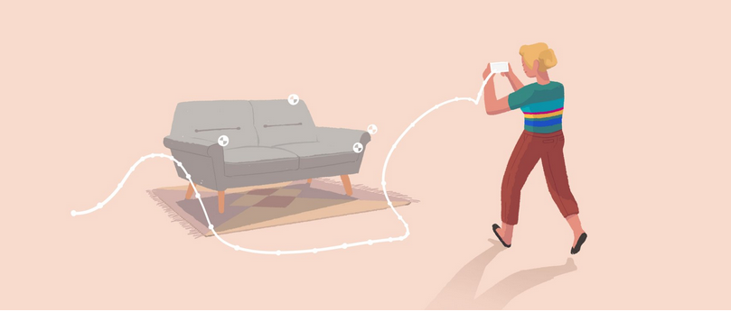
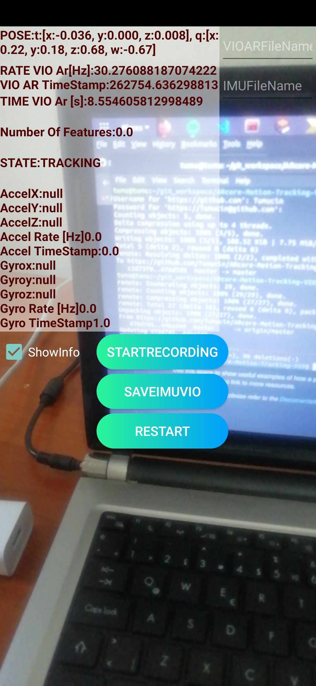
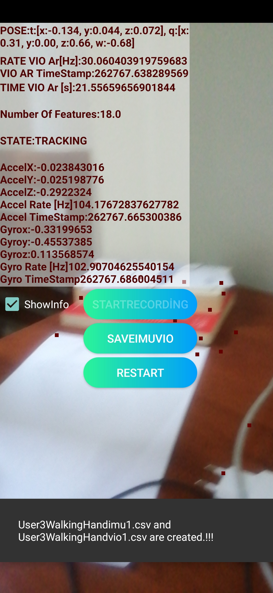
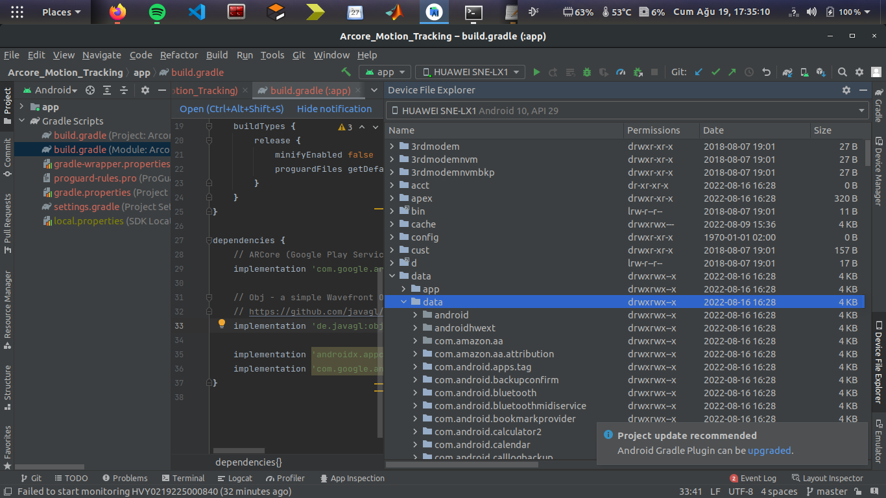

<!-- Improved compatibility of back to top link: See: https://github.com/othneildrew/Best-README-Template/pull/73 -->

<!--
*** Thanks for checking out the Best-README-Template. If you have a suggestion
*** that would make this better, please fork the repo and create a pull request
*** or simply open an issue with the tag "enhancement".
*** Don't forget to give the project a star!
*** Thanks again! Now go create something AMAZING! :D
-->

<!-- PROJECT SHIELDS -->
<!--
*** I'm using markdown "reference style" links for readability.
*** Reference links are enclosed in brackets [ ] instead of parentheses ( ).
*** See the bottom of this document for the declaration of the reference variables
*** for contributors-url, forks-url, etc. This is an optional, concise syntax you may use.
*** https://www.markdownguide.org/basic-syntax/#reference-style-links
-->
<!-- PROJECT LOGO -->
 

  

  <h3 align="center">Best-README-Template</h3>

  

    An awesome README template to jumpstart your projects!
     
    <a href="https://github.com/othneildrew/Best-README-Template"><strong>Explore the docs »</strong></a>
     
     
    <a href="https://github.com/othneildrew/Best-README-Template">View Demo</a>
    ·
    <a href="https://github.com/othneildrew/Best-README-Template/issues">Report Bug</a>
    ·
    <a href="https://github.com/othneildrew/Best-README-Template/issues">Request Feature</a>
  

<!-- TABLE OF CONTENTS -->

  
Table of Contents

  <ol>
    <li>
      <a href="#about-the-project">About The Project</a>
      <ul>
        <li><a href="#built-with">Built With</a></li>
      </ul>
    </li>
    <li>
      <a href="#getting-started">Getting Started</a>
      <ul>
        <li><a href="#prerequisites">Prerequisites</a></li>
        <li><a href="#installation">Installation</a></li>
      </ul>
    </li>
    <li><a href="#usage">Usage</a></li>
    <li><a href="#roadmap">Roadmap</a></li>
    <li><a href="#contributing">Contributing</a></li>
    <li><a href="#license">License</a></li>
    <li><a href="#contact">Contact</a></li>
    <li><a href="#acknowledgments">Acknowledgments</a></li>
  </ol>

<!-- ABOUT THE PROJECT -->
## About The Project
This project was made by using Android Studio Chipmunk | 2021.2.1, ARcore 1.32.0 on Ubuntu 18.04 and tested with Huawei Mate 20 Lite (Android 10, API Level: 29).
The goal of this project is to estimate the current 3 DoF position + 3 DoF orientation of the device using ARcore Motion Tracking(VIO) API and to save the IMU(accelerometer, gyroscope) and pose(VIO output) data to ".csv" file. 
<!-- PROJECT LOGO -->
 

  
  

    Motion Tracking Visualization
  

As your phone moves through the world, ARCore uses a process called simultaneous localization and mapping, or SLAM, to understand where the phone is relative to the world around it. ARCore detects visually distinct features in the captured camera image called feature points and uses these points to compute its change in location. The visual information is combined with inertial measurements from the device's IMU to estimate the pose (position and orientation) of the camera relative to the world over time.

By aligning the pose of the virtual camera that renders your 3D content with the pose of the device's camera provided by ARCore, developers are able to render virtual content from the correct perspective. The rendered virtual image can be overlaid on top of the image obtained from the device's camera, making it appear as if the virtual content is part of the real world.

(<a href="#readme-top">back to top</a>)

<!-- GETTING STARTED -->
## Getting Started

In this secion, I am going to descrice how we can use this mobile application on our Android devices to make everything clear. So that you can easily understand and use for your applications.

When you first start the application, you will see some VIO states such as 6Dof pose, rate, timestamp and the time passed. And you will see "VIOArFileName" and "IMUFileName" EditText which you can write the names of the files in terms of encoded numbers. There is no information about IMU yet. And there will be 3 different buttons for recording, saving the datas and restarting the application.

    
  </a>
  

    Figure 1
  

Since the goal of this application is to save the IMU and VIO data, we should give the names of the files to be recorded to Edit Text. For example I wrote "301" to "VIOArFileName" and "IMUFileName". After that we click the "STARTRECORDING" button. After clicking the button, you will see a message says "...csv and ...csv are created!!!". And that button becomes disabled automatically as we can see from figure 2. At this stage, we can now see the information about Accelerometer and Gyroscope on the screen.

    
  </a>
  

    Figure 2
  

If you want to save the IMU and VIO data to a file, all you need to do is to press the "SAVEIMUVIO" button. You will see a message says " ...csv and ...csv are saved!!!"

In order to get the files from the Android phone, you can open Android Studio -->Device File Explorer --> data/data/nameofTheProject/files as we can see from figure 3. 

    
  </a>
  

    Figure 2
  

<!-- USAGE EXAMPLES -->
## Usage

Use this space to show useful examples of how a project can be used. Additional screenshots, code examples and demos work well in this space. You may also link to more resources.

_For more examples, please refer to the [Documentation](https://example.com)_

(<a href="#readme-top">back to top</a>)

<!-- ROADMAP -->
## Roadmap

- [x] Add Changelog
- [x] Add back to top links
- [ ] Add Additional Templates w/ Examples
- [ ] Add "components" document to easily copy & paste sections of the readme
- [ ] Multi-language Support
    - [ ] Chinese
    - [ ] Spanish

See the [open issues](https://github.com/Tumucin/Arcore-Motion-Tracking/issues) for a full list of proposed features (and known issues).

(<a href="#readme-top">back to top</a>)

<!-- CONTRIBUTING -->
## Contributing

Contributions are what make the open source community such an amazing place to learn, inspire, and create. Any contributions you make are **greatly appreciated**.

If you have a suggestion that would make this better, please fork the repo and create a pull request. You can also simply open an issue with the tag "enhancement".
Don't forget to give the project a star! Thanks again!

1. Fork the Project
2. Create your Feature Branch (`git checkout -b feature/AmazingFeature`)
3. Commit your Changes (`git commit -m 'Add some AmazingFeature'`)
4. Push to the Branch (`git push origin feature/AmazingFeature`)
5. Open a Pull Request

(<a href="#readme-top">back to top</a>)

<!-- LICENSE -->
## License

Distributed under the MIT License. See `LICENSE.txt` for more information.

(<a href="#readme-top">back to top</a>)

<!-- CONTACT -->
## Contact

Tumucin : baltumucin34@gmail.com

Project Link: [Arcore - Motion - Tracking](https://github.com/Tumucin/Arcore-Motion-Tracking)

(<a href="#readme-top">back to top</a>)

<!-- ACKNOWLEDGMENTS -->
## Acknowledgments

You can check out the resources that I find very useful. 

* [ARCore Data Logger](https://github.com/PyojinKim/ARCore-Data-Logger)
* [Android Sensor Coordinate System](https://developer.android.com/guide/topics/sensors/sensors_overview#sensors-coords)
* [SensorEvent](https://developer.android.com/reference/android/hardware/SensorEvent)
* [ARcore - Quick Start for Android](https://developers.google.com/ar/develop/java/quickstart)
* [The Template that this project uses.](https://github.com/othneildrew/Best-README-Template)

(<a href="#readme-top">back to top</a>)

<!-- MARKDOWN LINKS & IMAGES -->
<!-- https://www.markdownguide.org/basic-syntax/#reference-style-links -->
[product-screenshot]: images/screenshot.png
[Next.js]: https://img.shields.io/badge/next.js-000000?style=for-the-badge&logo=nextdotjs&logoColor=white
[Next-url]: https://nextjs.org/
[React.js]: https://img.shields.io/badge/React-20232A?style=for-the-badge&logo=react&logoColor=61DAFB
[React-url]: https://reactjs.org/
[Vue.js]: https://img.shields.io/badge/Vue.js-35495E?style=for-the-badge&logo=vuedotjs&logoColor=4FC08D
[Vue-url]: https://vuejs.org/
[Angular.io]: https://img.shields.io/badge/Angular-DD0031?style=for-the-badge&logo=angular&logoColor=white
[Angular-url]: https://angular.io/
[Svelte.dev]: https://img.shields.io/badge/Svelte-4A4A55?style=for-the-badge&logo=svelte&logoColor=FF3E00
[Svelte-url]: https://svelte.dev/
[Laravel.com]: https://img.shields.io/badge/Laravel-FF2D20?style=for-the-badge&logo=laravel&logoColor=white
[Laravel-url]: https://laravel.com
[Bootstrap.com]: https://img.shields.io/badge/Bootstrap-563D7C?style=for-the-badge&logo=bootstrap&logoColor=white
[Bootstrap-url]: https://getbootstrap.com
[JQuery.com]: https://img.shields.io/badge/jQuery-0769AD?style=for-the-badge&logo=jquery&logoColor=white
[JQuery-url]: https://jquery.com 
